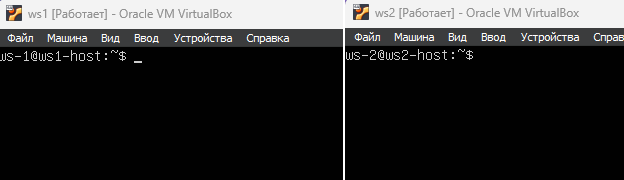
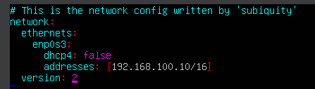
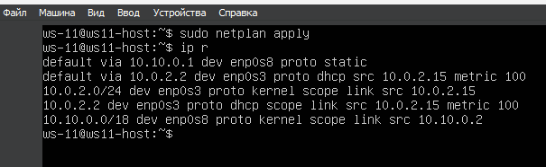
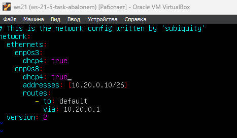
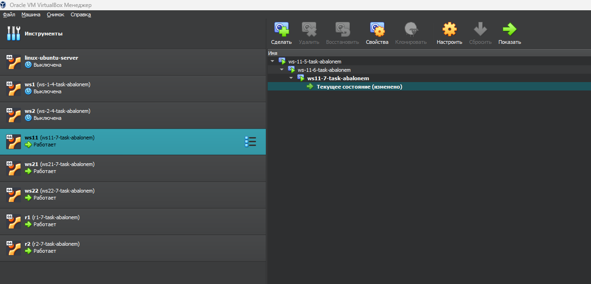

### Сети в Linux (Настройка сетей в Linux на виртуальных машинах)

## Part 1. Инструмент **ipcalc**

### Теория по инструменту **ipcalc**

`ipcalc` - это утилита командной строки для расчета параметров подсети IPv4.

Инструмент `ipcalc` можно использовать для выполнения следующих задач:

1. Проверка IP-адреса;
2. Отображение вычисленного широковещательного адреса;
3. Отображение имени хоста, определенного через DNS;
4. Отображение сетевого адреса или префикса.

<br>

**Запись команды**: ipcalc [ОПЦИЯ]... <IP - адрес>[/префикс] [маска сети]

- `-n` **(--nocolor)** - подавляет цветной вывод; \
- `-b` **(--nobinary)** - подавляет побитовый вывод; \
- `-c` **(--class)** - показывает маску сети; \
- `-h` **(--html)** - показывает результаты в HTML; \
- `-v` **(--version)** - показывает версию программы; \
- `-s` **(--split n1 n2 n3)** - разбивает сети на размеры n1, n2, n3; \
- `-r` **(--range)** - исключает диапазон адресов;

---

**== Задание ==**

##### Подними виртуальную машину (далее -- ws1)

#### 1.1. Сети и маски
##### Определи и запиши в отчёт:
##### 1) Адрес сети *192.167.38.54/13*
##### 2) Перевод маски *255.255.255.0* в префиксную и двоичную запись, */15* в обычную и двоичную, *11111111.11111111.11111111.11110000* в обычную и префиксную
##### 3) Минимальный и максимальный хост в сети *12.167.38.4* при масках: */8*, *11111111.11111111.00000000.00000000*, *255.255.254.0* и */4*

#### 1.2. localhost
##### Определи и запиши в отчёт, можно ли обратиться к приложению, работающему на localhost, со следующими IP: *194.34.23.100*, *127.0.0.2*, *127.1.0.1*, *128.0.0.1*

#### 1.3. Диапазоны и сегменты сетей
##### Определи и запиши в отчёт:
##### 1) Какие из перечисленных IP можно использовать в качестве публичного, а какие только в качестве частных: *10.0.0.45*, *134.43.0.2*, *192.168.4.2*, *172.20.250.4*, *172.0.2.1*, *192.172.0.1*, *172.68.0.2*, *172.16.255.255*, *10.10.10.10*, *192.169.168.1*
##### 2) Какие из перечисленных IP адресов шлюза возможны у сети *10.10.0.0/18*: *10.0.0.1*, *10.10.0.2*, *10.10.10.10*, *10.10.100.1*, *10.10.1.255*

---

**== Решение ==**

- Поднимем виртуальную машину (ws1): \
    

### 1.1. Сети и маски

- Установим **ipcalc** утилиту: 
    ```
    sudo apt install ipcalc
    ```
    

- Определим и запишем в отчёте следующее:

    - Адрес сети *192.167.38.54/13*:
        ```
        ipcalc 192.167.38.54/13
        ```
        

        **Адресс сети:** `192.167.38.54`
        
        >Здесь просят именно адрес сети, а не маску или саму сеть!
        ---
    
    - Перевод маски *255.255.255.0* в префиксную и двоичную запись:
        ```
        ipcalc 255.255.255.0 | grep -i -e Address -e Netmask
        ```
        

        **В префиксной записи:** `/24` \
        **В двоичной записи:** `11111111.11111111.11111111.00000000`

        ---

    - Перевод маски */15* в обычную и двоичную запись:
        ```
        ipcalc 0.0.0.0/15 | grep Netmask
        ```
        
        
        **В обычной записи:** `255.254.0.0` \
        **В двоичной записи:** `11111111.11111110.00000000.0000000`
        
        ---

    - Перевод маски *11111111.11111111.11111111.11110000* в обычную и префиксную:

        **Утилита ipcalc не принимает адреса, выраженные в двоичном формате**, поэтому перед этим необходимо привести их в 10 СИ:

        `11111111.11111111.11111111.11110000` -> `255.255.255.240`

        **Маску мы можем получить следующим образом** - поскольку IP адресс состоит из 32 бит, то нужно с конца (младшей октаты) считать биты до тех пор, пока не встретится самый старший 0 разряд.

        Имеем - 32 бита, самый старший 0 разряд расположен на 4 позиции, значит префиксное значение маски равно `28` **(32 - 4 = 28)**

        Получаем: `255.255.255.240/28`

        **ИЛИ**

        Вторым вариантом может послужить следующая запись:

        

        
        **В обычной записи:** `255.255.255.240` \
        **В префиксной записи:** `/28`

        ---

    - Минимальный и максимальный хост в сети *12.167.38.4* при масках: */8*:
        
        Команда (для этого и всех следующих пунктов в 1.1.3):
        ```
        ipcalc <address/mask> | grep -i -e Hostmin -e Hostmax
        ```

        

        **Минимально возможный хост:** `12.0.0.1` \
        **Максимально возможный хост:** `12.255.255.254`

    - Минимальный и максимальный хост в сети *12.167.38.4* при масках: *11111111.11111111.00000000.00000000*:

        Самый старший 0 разряд находится на 16 позиции, следовательно префикс маски - `16`

        

        **Минимально возможный хост:** `12.167.0.1` \
        **Максимально возможный хост:** `12.167.255.254`
    
    - Минимальный и максимальный хост в сети *12.167.38.4* при масках: *255.255.254.0*:

        **Как маску вписываем 255.255.254.0!**

        

        **Минимально возможный хост:** `12.167.38.1` \
        **Максимально возможный хост:** `12.167.39.254`

    - Минимальный и максимальный хост в сети *12.167.38.4* при масках: */4*:

        

        **Минимально возможный хост:** `0.0.0.1` \
        **Максимально возможный хост:** `15.255.255.254`

### 1.2. localhost

- Определим и запишем в отчёт, можно ли обратиться к приложению, работающуему на localhost, со следующими IP: *194.34.23.100*, *127.0.0.2*, *127.1.0.1*, *128.0.0.1*:

    - Мы можем ссылаться на приложение, запущенное на локальном хостинге, с ip-адресами: `127.0.0.2`, `127.1.0.1` поскольку есть **Loopback**:

        

        

    - Мы не можем ссылаться на приложение, запущенное на локальном хостинге с ip-адресами: `128.0.0.1`, `194.34.23.100`:

        

        

    - **Краткий ответ:** `194.34.23.100 - нет`, `127.0.0.2 - да`, `127.1.0.1 - да`, `128.0.0.1 - нет`

### 1.3. localhost

- Определим какие из перечисленных IP можно использовать в качестве публичного, а какие только в качестве частных: *10.0.0.45*, *134.43.0.2*, *192.168.4.2*, *172.20.250.4*, *172.0.2.1*, *192.172.0.1*, *172.68.0.2*, *172.16.255.255*, *10.10.10.10*, *192.169.168.1*:

    - Определение публичных и частных IP: \

        >К частным "серым" адресам относятся IP-адреса из следующих подсетей:<br><br>
        **От 10.0.0.0 до 10.255.255.255 с маской 255.0.0.0 или /8** \
        **От 172.16.0.0 до 172.31.255.255 с маской 255.240.0.0 или /12** \
        **От 192.168.0.0 до 192.168.255.255 с маской 255.255.0.0 или /16** \
        **От 100.64.0.0 до 100.127.255.255 с маской подсети 255.192.0.0 или /10** 

- Воспользуемся следующей командой:
    ```
    ipcalc <address/mask> | grep Hosts/Net
    ```

    - **Частные IP Адреса**: `10.0.0.45`, `192.168.4.2`, `172.20.250.4`, `172.16.255.255`, `10.10.10.10`:

        

    - **Публичные IP Адреса**: `134.43.0.2`, `172.0.2.1`, `192.172.0.1`, `172.68.0.2`, `192.169.168.1`:

        

- Определим какие из перечисленных IP адресов шлюза возможны у сети *10.10.0.0/18*: *10.0.0.1*, *10.10.0.2*, *10.10.10.10*, *10.10.100.1*, *10.10.1.255*:

    

    Диапазон возможных IP-адресов: 10.0.0.1 - 10.10.63.254

    - **Возможные адреса:** `10.10.0.2`, `10.10.10.10`, `10.10.1.255`
    
    - **Невозможные адреса:** `10.0.0.1`, `10.10.100.1`

## Part 2. Статическая маршрутизация между двумя машинами

**== Задание ==**

##### Подними две виртуальные машины (далее -- ws1 и ws2).

##### С помощью команды `ip a` посмотри существующие сетевые интерфейсы.
- В отчёт помести скрин с вызовом и выводом использованной команды.
##### Опиши сетевой интерфейс, соответствующий внутренней сети, на обеих машинах и задать следующие адреса и маски: ws1 - *192.168.100.10*, маска */16*, ws2 - *172.24.116.8*, маска */12*.
- В отчёт помести скрины с содержанием изменённого файла *etc/netplan/00-installer-config.yaml* для каждой машины.
##### Выполни команду `netplan apply` для перезапуска сервиса сети.
- В отчёт помести скрин с вызовом и выводом использованной команды.

#### 2.1. Добавление статического маршрута вручную
##### Добавь статический маршрут от одной машины до другой и обратно при помощи команды вида `ip r add`.
##### Пропингуй соединение между машинами.
- В отчёт помести скрин с вызовом и выводом использованных команд.

#### 2.2. Добавление статического маршрута с сохранением
##### Перезапусти машины.
##### Добавь статический маршрут от одной машины до другой с помощью файла *etc/netplan/00-installer-config.yaml*.
- В отчёт помести скрин с содержанием изменённого файла *etc/netplan/00-installer-config.yaml*.
##### Пропингуй соединение между машинами.
- В отчёт помести скрин с вызовом и выводом использованной команды.

---

**== Решение ==**

- Поднимем две виртуальные машины (ws1 и ws2):

    - Клонируем машину ws1 для ws2 и настраиваем нового пользователя: <br><br>
        

    - В настройках каждой машины, на вкладке Сеть, мы устанавливаем тип подключения: **Внутренняя сеть**

        

    - Далее для каждый из машин устанавливаем hostnames:

        - Virtual machine 1
            ```
            sudo hostnamectl set-hostname ws1-host
            ```

        - Virtual machine 2
            ```
            sudo hostnamectl set-hostname ws2-host
            ```
        В результате получаем две следующие машины, настроенных для дальнейшего взаимодействия:

        

- С помощью команды `ip a` просмотрим существующие сетевые интерфейсы:

    - Для первой машины `ip a`: <br><br>
        

    - Для второй машины `ip a`: <br><br>
        

    - Описание сетевых интерфейсов `ws1` и `ws2`: 
        >Интерфейс enp0s3 представляет собой проводное **(Ethernet)** соединение, которое включено (состояние UP). MAC-адрес составляет 08:00:27:09:72:ea. IP-адрес в данном выводе не указан. \
        Максимальный размер пакета (MTU) на интерфейсах составляет **1500 байт**. Используется алгоритм управления очередью данных **fq_codel** и принадлежат к группе по умолчанию. Размер очереди пакетов составляет **100**.

        - Чтобы узнать, есть ли IP-адреса на интерфейсах, используем вывод этой команды для определения наличия активных сетевых интерфейсов и их соответствующих IP-адресов:
            ```
            sudo apt-install net-tools
            netstat -nr
            ```

            На двух машинах нет наличия опрокинутых сетевых интерфейсов - поскольку установлена внутренняя сеть без настроек:

            
    
    - Теперь откроем конфигурационный файл **etc/netplan/00-installer-config.yaml**. После этого мы изменим поле `ip-адреса` в соответствии с поставленной задачей:
        ```
        sudo vim /etc/netplan/00-installer-config.yaml
        ```
        > **Зададим следующие адреса и маски:** ws1 - *192.168.100.10*, маска */16*, ws2 - *172.24.116.8*, маска */12*.
        
        Для первой виртуальной машины `ws1`:

        

        Для второй виртуальной машины `ws2`:

        

    - Запустим команду netplan apply, чтобы перезапустить сетевую службу:
        ```
        sudo netplan apply
        ```

        В результате для первой машины получаем: <br><br>
         <br>
         <br>
        В результате для второй машины получаем: <br><br>
         <br>
         <br>

### 2.1. Добавление статического маршрута вручную

- Добавим статический маршрут от одной машины к другой и обратно, используя команду `ip r add`: <br> <br>
    Для `ws1` -
    ```
    sudo ip route add 172.24.116.8 dev enp0s3
    ```
     <br>
    Для `ws2` -
    ```
    sudo ip route add 192.168.100.10 dev enp0s3
    ```
     <br>

- Пропингуем соединение между машинами:
    - `ping` от первой виртуальной машины до второй: <br>
        ```
        ping -c 5 172.24.116.8
        ```
         <br>
    - `ping` от второй виртуальной машины до первой: <br>
        ```
        ping -c 5 192.168.100.10
        ```
         

    >Как видно из скриншотов - мы успешно пропинговали машины **(0% packet loss)**

### 2.2. Добавление статического маршрута с сохранением

- Перезапустим машины:
    1. Первый вариант сброса добавленных маршрутов без сохранения:
        ```
        reboot
        ```
    2. Второй вариант сброса добавленных маршрутов без сохранения:
        ```
        sudo netplan apply
        ```

- Добавим статический маршрут от одной машины до другой с помощью файла `etc/netplan/00-installer-config.yaml`:
    ```
    sudo vim /etc/netplan/00-installer-config.yaml
    ```

    Для первой машины `ws1`: <br>
         <br>

    
    
    Для второй машины `ws2`: <br>
         <br>
        
    

- Пропингуем соединение между машинами:

    **Пинг от первой машины до второй:** <br>
         <br>
    **Пинг от второй машины до первой:** <br>
         <br>

## Part 3. Утилита **iperf3**

**== Задание ==**

*В данном задании используются виртуальные машины ws1 и ws2 из Части 2*

#### 3.1. Скорость соединения
##### Переведи и запиши в отчёт: 8 Mbps в MB/s, 100 MB/s в Kbps, 1 Gbps в Mbps.

#### 3.2. Утилита **iperf3**
##### Измерь скорость соединения между ws1 и ws2.
- В отчёт помести скрины с вызовом и выводом использованных команд.

**== Решение ==**

### 3.1. Скорость соединения
- Переведем и запишем в отчёт: 8 Mbps в MB/s, 100 MB/s в Kbps, 1 Gbps в Mbps:
    ```
    8Mbps == 1MB/s
    100MB/s == 819200 Kbps
    1Gbps == 1024 Mbps
    ```

### 3.2. Утилита **iperf3**

> **Утилита iperf** - это инструмент командной строки, который используется для измерения пропускной способности сети между двумя узлами. Этот инструмент позволяет проверять скорость передачи данных между сервером и клиентом. Он может быть использован для оценки производительности сети, оптимизации сетевых настроек и обнаружения узких мест.

- Для установки:
    ```
    sudo apt install iperf3
    ```

- Измерить скорость соединения между ws1 и ws2:

    >Чтобы измерить скорость между машинами, сервер должен назначить одну из них командой **"iperf3 -s"**, а клиент должен назначить вторую машину и отправить запрос на ранее указанный сервер командой **"iperf3 -c [ip-адрес сервера]"**.

    Для первой виртуальной машины `ws1` (слушатель):
    ```
    iperf3 -s
    ```
     <br>
    Для второй виртуальной машины `ws2` (отправитель):
    ```
    iperf3 -c 192.168.100.10
    ```
     <br>

    **Скорость соединения между ws1 и ws2:** `670 Mbits/sec` (670000 Kbps)

## Part 4. Сетевой экран

**== Задание ==**

*В данном задании используются виртуальные машины ws1 и ws2 из Части 2*

#### 4.1. Утилита **iptables**
##### Создай файл */etc/firewall.sh*, имитирующий фаерволл, на ws1 и ws2:

##### Нужно добавить в файл подряд следующие правила:
##### 1) На ws1 примени стратегию, когда в начале пишется запрещающее правило, а в конце пишется разрешающее правило (это касается пунктов 4 и 5).
##### 2) На ws2 примени стратегию, когда в начале пишется разрешающее правило, а в конце пишется запрещающее правило (это касается пунктов 4 и 5).
##### 3) Открой на машинах доступ для порта 22 (ssh) и порта 80 (http).
##### 4) Запрети *echo reply* (машина не должна «пинговаться», т.е. должна быть блокировка на OUTPUT).
##### 5) Разреши *echo reply* (машина должна «пинговаться»).
- В отчёт помести скрины с содержанием файла */etc/firewall* для каждой машины.
##### Запусти файлы на обеих машинах командами `chmod +x /etc/firewall.sh` и `/etc/firewall.sh`.
- В отчёт помести скрины с запуском обоих файлов;
- В отчёте опиши разницу между стратегиями, применёнными в первом и втором файлах.

#### 4.2. Утилита **nmap**
##### Командой **ping** найди машину, которая не «пингуется», после чего утилитой **nmap** покажи, что хост машины запущен.
*Проверка: в выводе nmap должно быть сказано: `Host is up`*.
- В отчёт помести скрины с вызовом и выводом использованных команд **ping** и **nmap**.

##### Сохрани дампы образов виртуальных машин

**== Решение ==**

## 4.1. Утилита **iptables**:

> **Утилита iptables** - является инструментом для управления правилами фильтрации пакетов в Linux. Она позволяет администраторам конфигурировать правила брандмауэра `(firewall)` в Linux-системах, управляя тем, какие сетевые пакеты принимаются, отклоняются или перенаправляются. В основном используется для обеспечения безопасности и контроля доступа к сети.

- Создадим файл */etc/firewall.sh*, имитирующий фаерволл, на `ws1` и `ws2` с правилами, которые указаны в **пунктах задания**:

    - Для первой виртуальной машины создадим */etc/firewall.sh*: <br>
        

    - Для второй виртуальной машины создадим */etc/firewall.sh*: <br>
        

    > **Пояснение:** Разница между стратегиями, применяемыми в первом и втором файлах, заключается в следующем: в утилите iptables правила выполняются сверху вниз. На первом компьютере сначала указывается правило, запрещающее выход, поэтому он не сможет пропинговать другой компьютер. Вторая машина, напротив, имеет разрешающее правило, указанное первой, что означает, что она сможет пинговать другую машину.

    - Запустим файлы на обеих машинах командами `chmod +x /etc/firewall.sh` и `/etc/firewall.sh`:

        ```
        sudo chmod +x /etc/firewall.sh

        sudo bash /etc/firewall.sh
        ```
        Для `ws1`:

         <br><br>
        Для `ws2`:

         

## 4.2. Утилита **nmap**
    
- Используем команду ping, чтобы найти компьютер, который не проверяется, затем используем утилиту nmap, чтобы показать, что хост компьютера включен:

    - Виртуальная машина `ws1` пингует `ws2`: <br>
        

    - Виртуальная машина `ws2` не может пропинговать `ws1` из-за `firewall`: <br>
        

- Покаже, запущен ли хост `ws1`, с помощью команды `nmap -Pn [адрес]`: <br>
    

    > На скриншоте показано, что `1 IP address` поднят и работает, а именно машина, которую мы пытались пинговать **(1 host up)** 

---

- Сохраним дампы образов виртуальных машин:

    - Для сохраненения необходимо открыть выпадающий список в `Virtual Box`, далее - `сделать снимок` **(dump)**: <br><br>
        

        > При создании задается название и описание снимка.
    
    - После сохранения снимок будет отображаться следующим образом:

        

    - В итоге для двух машин получится следующее:

        

> Отключаем машины и завершаем выполнение данного таска.

## Part 5. Статическая маршрутизация сети

**== Задание ==**

##### Подними пять виртуальных машин (3 рабочие станции (ws11, ws21, ws22) и 2 роутера (r1, r2)).

#### 5.1. Настройка адресов машин
##### Настрой конфигурации машин в *etc/netplan/00-installer-config.yaml* согласно сети на рисунке.
- В отчёт помести скрины с содержанием файла *etc/netplan/00-installer-config.yaml* для каждой машины.
##### Перезапусти сервис сети. Если ошибок нет, то командой `ip -4 a` проверь, что адрес машины задан верно. Также пропингуй ws22 с ws21. Аналогично пропингуй r1 с ws11.
- В отчёт помести скрины с вызовом и выводом использованных команд.

#### 5.2. Включение переадресации IP-адресов
##### Для включения переадресации IP, выполни команду на роутерах:
`sysctl -w net.ipv4.ip_forward=1`
*При таком подходе переадресация не будет работать после перезагрузки системы.*
- В отчёт помести скрин с вызовом и выводом использованной команды.
##### Открой файл */etc/sysctl.conf* и добавь в него следующую строку:
`net.ipv4.ip_forward = 1`
*При использовании этого подхода, IP-переадресация включена на постоянной основе.*
- В отчёт помести скрин с содержанием изменённого файла */etc/sysctl.conf*.

#### 5.3. Установка маршрута по-умолчанию
Пример вывода команды `ip r` после добавления шлюза:
```
default via 10.10.0.1 dev eth0
10.10.0.0/18 dev eth0 proto kernel scope link src 10.10.0.2
```
##### Настрой маршрут по-умолчанию (шлюз) для рабочих станций. Для этого добавь `default` перед IP роутера в файле конфигураций.
- В отчёт помести скрин с содержанием файла *etc/netplan/00-installer-config.yaml*;
##### Вызови `ip r` и покажи, что добавился маршрут в таблицу маршрутизации.
- В отчёт помести скрин с вызовом и выводом использованной команды.
##### Пропингуй с ws11 роутер r2 и покажи на r2, что пинг доходит. Для этого используй команду:
`tcpdump -tn -i eth0`
- В отчёт помести скрин с вызовом и выводом использованных команд.

#### 5.4. Добавление статических маршрутов
##### Добавь в роутеры r1 и r2 статические маршруты в файле конфигураций. Пример для r1 маршрута в сетку 10.20.0.0/26:
```shell
# Добавь в конец описания сетевого интерфейса eth1:
- to: 10.20.0.0
  via: 10.100.0.12
```
- В отчёт помести скрины с содержанием изменённого файла *etc/netplan/00-installer-config.yaml* для каждого роутера.
##### Вызови `ip r` и покажи таблицы с маршрутами на обоих роутерах. Пример таблицы на r1:
```
10.100.0.0/16 dev eth1 proto kernel scope link src 10.100.0.11
10.20.0.0/26 via 10.100.0.12 dev eth1
10.10.0.0/18 dev eth0 proto kernel scope link src 10.10.0.1
```
- В отчёт помести скрин с вызовом и выводом использованной команды.
##### Запусти команды на ws11:
`ip r list 10.10.0.0/[маска сети]` и `ip r list 0.0.0.0/0`
- В отчёт помести скрин с вызовом и выводом использованных команд;
- В отчёте объясни, почему для адреса 10.10.0.0/\[маска сети\] был выбран маршрут, отличный от 0.0.0.0/0, хотя он попадает под маршрут по-умолчанию.

---

**== Решение ==**

- Поднимем пять виртуальных машин (3 рабочие станции (ws11, ws21, ws22) и 2 роутера (r1, r2))

    

- В настройках Virtualbox меняем типы соединения:
    - ws11, ws21, ws22: <br>
        **Адаптер 1** - NAT <br>
        **Адаптер 2** -  Внутренняя сеть <br><br>
    - r1, r2: <br>
        **Адаптер1** - NAT <br>
        **Адаптер 2** - Внутренняя сеть <br>
        **Адаптер 3** - Внутренняя сеть <br><br>
    
    > На скриншоте выше отображены соединения для **r1**

    - Благодаря этому у машин появятся новые интерфейсы, которые можно настроить в соответствии со схемой.

### 5.1. Настройка адресов машин

- Настроим конфигурации машин в *etc/netplan/00-installer-config.yaml* согласно сети на рисунке:
    

    - **Изменим конфигурацию рабочих станций `ws11`, `ws21`, `ws22`:**

        Конфигурационный файл `ws11:` <br><br>
        

        Конфигурационный файл `ws21:` <br><br>
        

        Конфигурационный файл `ws22:` <br><br>
        

    - **Изменим конфигурацию роутеров `r1`, `r2`:**

        Конфигурационный файл `r1:` <br><br>
        

        Конфигурационный файл `r2:` <br><br>
        

- Перезапустим сервис сети с помощбю `sudo netplan apply`. Командой `ip -4 a`, проверим, что адрес машины задан верно:

    Адреса для `ws11:` <br><br>
        
    
    Адреса для `ws21:` <br><br>
        
    
    Адреса для `ws22:` <br><br>
        
    
    Адреса для `r1` <br><br>
        
    
    Адреса для `r2` <br><br>
        

- Пропингуем `ws22` с `ws21`: <br><br>
    ```
    ping -c 4 10.20.0.10
    ```
    
- Пропингуем `r1` с `ws11`: <br><br>
    ```
    ping -c 4 10.10.0.2
    ```
    
    
### 5.2. Включение переадресации IP-адресов

- Включим переадресацию IP-адресов, выполнив следующую команду на роутерах: <br>
    *При таком подходе переадресация не будет работать после перезагрузки системы.*
    ```
    sysctl -w net.ipv4.ip_forward=1
    ```

    **На виртуальной машине `r1`:**<br>
    
    **На виртуальной машине `r2`:**<br>
    

- Откроем файл */etc/sysctl.conf* и добавь в него следующую строку:
    ```
    net.ipv4.ip_forward = 1
    ```

    *При использовании этого подхода, IP-переадресация включена на постоянной основе.*

    **Результат для виртуальной машины `r1` и `r2`:
    ```
    sudo vim /etc/sysctl.conf
    ```

    

    

### 5.3. Установка маршрута по-умолчанию

- Настроим маршрут по-умолчанию (шлюз) для рабочих станций. Для этого добавим `default` перед IP роутера в файле конфигураций.

    - Для виртуальной машины `ws11`: <br><br>
        

    - Для виртуальной машины `ws21`: <br><br>
        

    - Для виртуальной машины `ws22`: <br><br>
        


- Примем изменения с помощью` sudo netplan apply` <br>
- Просмотрим с помощью `ip r`, что маршрут был добавлен в таблицу маршрутизации. Первая строчка с _default_ соответсвует добавленным маршрутам

    - Для виртуальной машины `ws11`: <br><br>
        

    - Для виртуальной машины `ws21`: <br><br>
        

    - Для виртуальной машины `ws22`: <br><br>
        

- Отправим запрос на маршрутизатор `r2` с `ws11` и покажем на `r2`, что сигнал получен. Для этого используем следующую команду:
    ```
    tcpdump -tn -i eth1
    ```

    > **Примечание:** ping отправиться на host `r2` однако ответ к нам не вернётся поскольку **маршрутизатор** "не знает", куда возвращать ответ, в то время как осуществляется передача пакетов с компьютера.

    - С виртуальной машины **ws11** запускаем утилиту *ping* до маршрутизатора (как видим, результат ответа к нам не приходит), **НО ПО ЗАДАНИЮ СКАЗАНО СЛЕДУЮЩЕЕ**: `показать, что пинг доходит до маршрутизатора`.
        ```
        ping -c 5 10.100.0.12
        ```
        
    - Для виртуальный машины `r2` (маршрутизатор) запускаем команду:
        ```
        tcpdump -tn -i enp0s9
        ```
        
        > **Примечание**: данную команду запускаем перед запуском утилиты ping с машины `ws11`, чтобы начать прослушивать.

        Таким образом, пинг с `ws11` доходит до `r2`, но поскольку роутеру неизвестно, куда возвращать пакеты, они не возвращаются назад, о чем сообщает результаты команды **"0 received, 100% lost"**.

### 5.4. Добавление статических маршрутов

- Добавим в роутеры `r1` и `r2` статические маршруты в файле конфигураций:

    - Для виртуальной машины `r1`:
        ```
        sudo vim /etc/netplan/00-installer-config.yaml
        ```

        
        
    - Для виртуальной машины `r2`:
        ```
        sudo vim /etc/netplan/00-installer-config.yaml
        ```
        
        

    > Применить изменения, используя команду **sudo netplan apply**

- Вызовем `ip r` и покажи таблицы с маршрутами на обоих роутерах:
    ```
    ip r
    ```
    - Для виртуальной машины `r1`:

        

    - Для виртуальной машины `r2`:

        

---

- Запустим команды на **ws11**:
    ```
    ip r list 10.10.0.0/18
    ip r list 0.0.0.0/0
    ```
    
    

    **Объясним, почему для 10.10.0.0/18 был выбран другой маршрут, отличный от 0.0.0.0/0, хотя это мог быть маршрут по умолчанию:**

    > Для адреса `10.10.0.0/18` не был выбран маршрут `0.0.0.0/0`, потому что пакеты отправляется на него только тогда, когда другой маршрут **не задан явным образом в таблице маршрутизации хоста**. Так как `ws11` находится внутри сети `10.10.0.0/18`, то для связи с ней она использует свой IP-адрес `10.10.0.2`. Адрес `0.0.0.0/0` находится в другой сети, поэтому `ws1` отправляет данные на роутер, используя маршрут по умолчанию, прописанный в файле конфигурации `(10.10.0.1)`

    > У статических маршрутов также выше приоритет - имеют более высокий приоритет перед общими маршрутами по умолчанию.

    ### 5.5. Построение списка маршрутизаторов

    - Запусти на `r1` перехват сетевого трафика, проходящего через `enp0s8` с помощью команды:
        ```
        tcpdump -tn -i enp0s8
        ``` 

        *Включаем перехват сетевого трафика:*

        

    - Пропингуем с `ws11` несуществующий IP (например, *10.30.0.111*) с помощью команды:
        ```
        ping -c 1 10.30.0.111
        ```

        

    - В результате маршрутизатор перехватил следующий сетевой трафик:

        
---

- При помощи утилиты **traceroute** построим список маршрутизаторов на пути от `ws11` до `ws21`:

    

    >
    Из дампа на `r1` видно, что пакет проходит через маршрутизаторы для достижения указанного адреса. На этом основан принцип работы traceroute.<br><br>
     **Traceroute** – это утилита, используемая для определения маршрута, который пакет данных проходит от отправителя к указанному получателю в сети. Основная задача traceroute заключается в выявлении узлов (маршрутизаторов) и времени, необходимого для прохождения пакетов через каждый из них. <br><br>
    Принцип работы traceroute основан на том, что каждый отправляемый пакет данных содержит поле Time-To-Live (TTL) в своем заголовке. Этот TTL представляет собой счетчик, который уменьшается на единицу каждый раз, когда пакет проходит через маршрутизатор. Когда TTL достигает нуля, пакет уничтожается, и маршрутизатор отправляет обратно сообщение об ошибке (Time Exceeded) отправителю. <br><br>
    Traceroute начинает отправку пакетов с небольшим TTL (обычно равным 1) и увеличивает его по мере выполнения запросов. Путем наблюдения за маршрутом и временем, затраченным на достижение каждого узла, traceroute формирует список всех узлов, через которые проходят пакеты до достижения целевого узла. <br><br>
    Обычно traceroute использует UDP пакеты и отправляет несколько пакетов с одним TTL на каждом шаге. Когда traceroute получает ответ от целевого узла, указывающий на недоступность порта, это сигнализирует о завершении трассировки.

    ### 5.6. Использование протокола **ICMP** при маршрутизации

    > **_ICMP_** (англ. Internet Control Message Protocol — протокол межсетевых управляющих сообщений) — сетевой протокол, входящий в стек протоколов TCP/IP. В основном ICMP используется для передачи сообщений об ошибках и других исключительных ситуациях, возникших при передаче данных

    - Запустим на `r1` команду: 
        ```
        tcpdump -n -i enp0s8 icmp
        ```

        

    - Пропингуем с ws11 несуществующий IP с помощью команды:
        ```
        ping -c 1 10.30.0.111
        ```

        

    - Отследим перехват сетевого трафика, проходящего через *enp0s8* на `r1`:

        

    > Таким образом, пакеты, отправителенные на `10.30.0.111`, проходят через путь по-умолчанию через роутер `r1`

- Сохраним дампы образов виртуальных машин `ws11`, `ws21`, `ws22`, `r1`, `r2`:

    

## Part 6. Динамическая настройка IP с помощью **DHCP**

**== Задание ==**

*В данном задании используются виртуальные машины из Части 5.*

##### Для r2 настрой в файле */etc/dhcp/dhcpd.conf* конфигурацию службы **DHCP**:
##### 1) Укажи адрес маршрутизатора по-умолчанию, DNS-сервер и адрес внутренней сети.

##### 2) В файле *resolv.conf* пропиши `nameserver 8.8.8.8`.

##### Перезагрузи службу **DHCP** командой `systemctl restart isc-dhcp-server`. Машину ws21 перезагрузи при помощи `reboot` и через `ip a` покажи, что она получила адрес. Также пропингуй ws22 с ws21.

##### Укажи MAC адрес у ws11, для этого в *etc/netplan/00-installer-config.yaml* надо добавить строки: `macaddress: 10:10:10:10:10:BA`, `dhcp4: true`.

##### Для r1 настрой аналогично r2, но сделай выдачу адресов с жесткой привязкой к MAC-адресу (ws11). Проведи аналогичные тесты.

##### Запроси с ws21 обновление ip адреса.

**== Решение ==**

- Настроим в файле */etc/dhcp/dhcpd.conf* для маршрутизатора **`r2`** конфигурацию службы **DHCP**.

    - Для работы с протоколом DHCP сначала надо установим утилиту на r2: 
        ```
        sudo apt-get install isc-dhcp-server
        ```

    - Укажем адрес маршрутизатора `по-умолчанию`, `DNS-сервер` и `адрес внутренней сети` для маршрутизатора `r2`:
        ```
        sudo vim /etc/dhcp/dhcpd.conf
        ```

        

    - В файле *resolv.conf* пропиши `nameserver 8.8.8.8`:
        ```
        sudo vim /etc/resolv.conf
        ```

        

    - Перезагрузим службу **DHCP** и проверим её статус:
        ```
        systemctl restart isc-dhcp-server
        systemctl status isc-dhcp-server
        ```

        

        
    
    - Поскольку в сети появился DHCP-сервер, в файле конфигурации `etc/netplan/00-installer-config.yaml` изменим `dhcp: true` у `ws21` и `ws22`:

        

        

    - Перезагрузим `ws21` и `ws22` при помощи `reboot` и через `ip a` покажем, что они получили новый адрес от **DHCP**:
        ```
        reboot
        ip a
        ```

        

        

        > Видим, что машины `ws21` и `ws22` получили динамический IP-адрес: **10.20.0.4/26** и **10.20.0.5/26**

    - Пропингуем `ws22` с `ws21`:

        

- Указать MAC адрес у ws11, для этого в `etc/netplan/00-installer-config.yaml` надо добавить строки:
    ```
    macaddress: 10:10:10:10:10:BA, dhcp4: true
    ```
    

    - Принимаем изменения: **`sudo netplan apply`**

    - Также включаем VM и в настройках сети указываем **MAC-адрес**:

        

- Для работы с протоколом DHCP сначала надо установить утилиту на r1:
    ```
    sudo apt-get install isc-dhcp-server
    ```

    - Для `r1` настроим в файле `/etc/dhcp/dhcpd.conf` конфигурацию службы DHCP:

        

    - В файле *resolv.conf* пропишем `nameserver 8.8.8.8`:

        
    
    - Для `r1` перезагрузим службу **DHCP** и проверим её статус командами:
        ```
        systemctl restart isc-dhcp-server
        systemctl status isc-dhcp-server
        ```

        

    - Для машины `ws11` делаем перезагрузку через `reboot` и показываем, что `ws11` получила **mac-адрес** и ниже указан новый `ip-адрес`, полученный через **DHCP** - `10.10.0.3`:

        

    - Пропингуем `ws11` с `ws21`:

        

- Запросим с `ws21` обновлeние ip адреса, для этого необходимо выполнить следующие действия:

    - Для начала отобразим текущий ip адрес:

        

    - Освободим `IP адрес` и получим от **DHCP** новый `IP адрес`:
        ```
        sudo dhclient -r enp0s8
        sudo dhclient
        ```
        
        

        > На скриншоте показано, что старый адрес был успешно сброшен и получен новый

        >**В шестой части использовались следующие параметры протокола DHCP:**<br><br>**Параметр ip-адрес маршрутизатора** [, ip-адрес...]; - адреса шлюзов для клиентской сети. Маршрутизаторы должны быть перечислены в порядке предпочтения.<br><br>
        **Параметр доменное имя-ip-адрес сервера** [, ip-адрес...]; - Список DNS-серверов, доступных клиенту. Серверы должны быть перечислены в порядке предпочтения.

- Сохраним дампы образов виртуальных машин `ws11`, `ws21`, `ws22`, `r1`, `r2`:

    

## Part 7. **NAT**

> **NAT (Network Address Translation)** - это процесс перевода сетевых адресов из одного диапазона в другой в сети компьютеров. Обычно это используется для перевода частных IP-адресов в общедоступные IP-адреса и наоборот. NAT позволяет нескольким устройствам в локальной сети использовать один общедоступный IP-адрес для доступа в интернет, что сокращает количество необходимых публичных IP-адресов и увеличивает безопасность сети, скрывая внутренние устройства за одним внешним адресом.

- В файле */etc/apache2/ports.conf* на ws22 и r1 измени строку `Listen 80` на `Listen 0.0.0.0:80` - сделаем сервер Apache2 общедоступным.
    ```
    sudo vim /etc/apache2/ports.conf
    ```

    > **Примечание:** убедитесь, что Apache установлен, если его нету, то выполните следующую команду:
    ```
    sudo apt install apache2
    ```

    На виртуальной машине `ws22`:

    

    На виртуальной машине `r2`:

    

- Запустим сервер **Apache2** командой.
    ```
    service apache2 start
    ```

    На машине `ws22`:<br>
    

    На машине `r2`:<br>
    

- Добавим в фаервол, созданный по аналогии с фаерволом из Части 4, на r2 следующие правила:<br>
    - Удаление правил в таблице filter - `iptables -F`;

    - Удаление правил в таблице "NAT" - `iptables -F -t nat`;

    - Отбрасывать все маршрутизируемые пакеты - `iptables --policy FORWARD DROP`.

    Для виртуальной машины `r2`:

    

- Затем запустим созданный файл с помощью команды `sudo /etc/firewall.sh` и проверим соединение между `ws22` и `r1`.

    У виртуальной машины `r2`:
    ```
    sudo chmod +x /etc/firewall.sh
    sudo sh /etc/firewall.sh
    ```

    

    Проверим соединение между `ws22` и `r1` командой `ping`.

    - От `ws22`:

        

    - От `r1`:

        


    > **FORWARD** используется для обработки предназначенного для других серверов трафика, который не был создан на данном сервере. Эта цепочка в основном необходима для маршрутизации запросов на другие серверы.<br><br>
    Поэтому при правиле **FORWARD DROP** ws22 не "пингуется" с r1

- Добавим в файл ещё одно правило - разрешим маршрутизацию всех пакетов протокола **ICMP**:

    

    - Запустим файл командами `chmod +x /etc/firewall.sh` и `/etc/firewall.sh`

    - С помощью `iptables -L` рассмотрим, как выполняется просмотр правил:

        
    
    Проверим соединение между `ws22` и `r1` командой `ping`.

    - От `ws22`:

        

    - От `r1`:

        

    *При запуске файла с этими правилами, ws22 должна «пинговаться» с r1.* - **Выполняется**

- Добавить в файл ещё два правила:

    5) включим **SNAT**, а именно маскирование всех локальных ip из локальной сети, находящейся за `r2` (по обозначениям из Части 5 - сеть 10.20.0.0) <br><br>
    6) включим **DNAT** на `8080` порт машины `r2` и добавить к веб-серверу Apache, запущенному на `ws22`, доступ извне сети

    

    - Первая команда для **SNAT**:
        ```
        iptables -t nat -A POSTROUTING -o enp0s8 -s 10.20.0.0/26 -p tcp -j SNAT --to-source 10.100.0.12
        ```

        > **Эта команда добавляет правило в таблицу NAT (-t nat).** Она применяется к пакетам, которые проходят через цепочку `POSTROUTING`. <br>Далее, флаг **`-o enp0s8`** указывает интерфейс, через который будут отправляться пакеты после применения этого правила (в данном случае, enp0s8). <br>Опция **`-s 10.20.0.0/26`** задает исходный IP-адрес или диапазон, к которому применяется это правило (в данном случае, пакеты с исходным IP в диапазоне **`10.20.0.0/26`**). <br>Опция `-p tcp` указывает, что это правило применяется только к TCP-пакетам. <br>Флаг **`-j SNAT`** указывает, что при применении правила произойдет маскировка исходного IP-адреса.<br>Опция **`--to-source 10.100.0.12`** определяет новый исходный IP-адрес, на который будет заменен исходный адрес.

        > **SNAT (Source Network Address Translation)** - это процесс замены исходного IP-адреса пакета в сети с использованием NAT. Когда пакет отправляется из локальной сети во внешнюю сеть, SNAT заменяет исходный IP-адрес пакета на другой IP-адрес, обычно на IP-адрес шлюза или другой общедоступной точки выхода в сеть. Это позволяет скрыть реальные IP-адреса локальных узлов от внешнего мира и обеспечить эффективное использование ограниченного числа общедоступных IP-адресов.
    
    - Вторая команда для **DNAT**:
        ```
        iptables -t nat -A PREROUTING -p tcp -d 10.20.0.1 --dport 8080 -j DNAT --to-destination 10.20.0.20:80
        ```

        > **Эта команда также добавляет правило в таблицу NAT (-t nat).** Она применяется к пакетам, которые проходят через цепочку `PREROUTING`. <br>
        Флаг **`-p tcp`** указывает, что это правило применяется только к TCP-пакетам.<br> Опция **`-d 10.20.0.1`** задает целевой IP-адрес, к которому применяется это правило (в данном случае, **10.20.0.1**).<br> Опция **`--dport 8080`** определяет порт назначения, к которому применяется это правило (в данном случае, порт **8080**).<br> Флаг **`-j DNAT`** указывает, что при применении правила произойдет перенаправление **(Destination NAT)** пакета.<br> **`Опция --to-destination 10.20.0.20:80`** определяет новый IP-адрес и порт, на который будет перенаправлен пакет.

        > **DNAT (Destination Network Address Translation)** - это процесс замены целевого IP-адреса и/или порта пакета в сети с использованием NAT. Когда пакет приходит из внешней сети в локальную сеть, DNAT изменяет целевой IP-адрес и/или порт пакета на другой IP-адрес и/или порт, что позволяет перенаправлять пакеты на различные устройства или порты внутри локальной сети. DNAT часто используется для реализации перенаправления портов (port forwarding) или для балансировки нагрузки.
    
    - Запустим файл командами:
        ```
        chmod +x /etc/firewall.sh
        sh /etc/firewall.sh
        ```

        

    - Проверить соединение по TCP для **SNAT**:
        
        - В настройках Virtualbox отключим сетевой интерфейс `NAT`

        - Проверим соединение по TCP для SNAT. Подключимся к серверу Apache с ws22 на r1 командой: `telnet [адрес] [порт]`

        

    - Проверить соединение по TCP для **DNAT**:

        С `r1` подключимся к серверу Apache на `ws22` командой telnet (обращаться по адресу `r2` и порту `8080`)

        

- Сохраним дампы образов виртуальных машин из 7 задания:

    

## Part 8. Дополнительно. Знакомство с **SSH Tunnels**

**== Задание ==**

*В данном задании используются виртуальные машины из Части 5.*

##### Запусти на r2 фаервол с правилами из Части 7.
##### Запусти веб-сервер **Apache** на ws22 только на localhost (то есть в файле */etc/apache2/ports.conf* измени строку `Listen 80` на `Listen localhost:80`).
##### Воспользуйся *Local TCP forwarding* с ws21 до ws22, чтобы получить доступ к веб-серверу на ws22 с ws21.
##### Воспользуйся *Remote TCP forwarding* c ws11 до ws22, чтобы получить доступ к веб-серверу на ws22 с ws11.
##### Для проверки, сработало ли подключение в обоих предыдущих пунктах, перейди во второй терминал (например, клавишами Alt + F2) и выполни команду:
`telnet 127.0.0.1 [локальный порт]`

**== Решение ==**

- Запустим на r2 фаервол с правилами из Части 7:<br>
    

- Запустим веб-сервер Apache на `ws22` только на `localhost` (то есть в файле `/etc/apache2/ports.conf` изменить строку `Listen 80` на `Listen localhost:80`)

    

    


- **Важное примечание:** на `ws-22` должны быть произведены следующие команды для корректной работы:
    ```
    sudo apt update
    sudo apt install openssh-server
    ```

    - После установки `openssh-server` запускаем следующую службу:
        ```
        sudo systemctl start sshd
        ```


- Воспользуемся *Local TCP forwarding* с `ws21` до `ws22`, чтобы получить доступ к веб-серверу на `ws22` с `ws21`.

    > **ВАЖНО**: Обязательно указывайте пользователя, к которому необходимо подключиться для корректной авторизации.

    C помощью команды ssh получим доступ к вебсерверу на `ws22` c `ws21`:
    ```
    sudo ssh -L 8080:localhost:80 -l ws-22 10.20.0.20
    ```

    Итоговый результат, который был получен:

    

    Проверка подключения:

    

- Воспользуемся *Remote TCP forwarding* c `ws11` до `ws22`, чтобы получить доступ к веб-серверу на `ws22` с `ws11`.

    Итоговый результат, который был получен:

    

    Проверка подключения:

    


    


    


    


    


        


